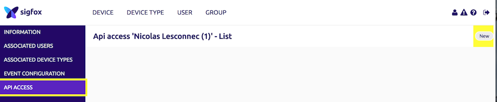

# Sigfox device tracking

Show on a map the position history of any sigfox device

## How

* Fetch data using the Sigfox API
* Rely the [Sigfox Atlas](https://www.sigfox.com/en/sigfox-geolocation) network-based geolocation service to retrieve position history
* Display data on an [OpenStreetMap](http://openstreetmap.org) map, using [Leaflet](http://leafletjs.com)

## Setup

### Get a Sigfox device

If you do not have a Sigfox device yet, the easier way is to buy one the compatible [Development Kits](https://partners.sigfox.com/products/kit).

They all come with included access to the full Sigfox service.

### Retrieve your Sigfox API Credentials

Complete guide available [here](https://resources.sigfox.com/document/api-credential-creation)

* Login to your [Sigfox Cloud](http://backend.sigfox.com) account
* Navigate to your _Group_, and enter the _API Access_ menu

Create an API credentials pair. You will need `DEVICES_MESSAGES[R]` rights at least.

### Set up your Sigfox Geolocation service

To get your device's position computed, you first need to set up a `Geoloc`callback. It can be either a push to an URI, or an email.

Follow the [complete guide](https://resources.sigfox.com/document/geocallback-creation) on our Resources website

## Install
` $ npm install`

## Run
Set the following 3 environnement vars :
* `API_LOGIN` : Sigfox API Login. Not your [Sigfox Cloud](http://backend.sigfox.com) login !
* `API_PASSWORD`: Sigfox API Password. Again, not your Sigfox Cloud password!
* `LEAFLET_TOKEN` : Your [Leaflet](http://leafletjs.com) token

` $ npm start `

## Use

* Device `deviceId` history : http://localhost:8001/devices/`deviceId`
* List of available devices : http://localhost:8001

